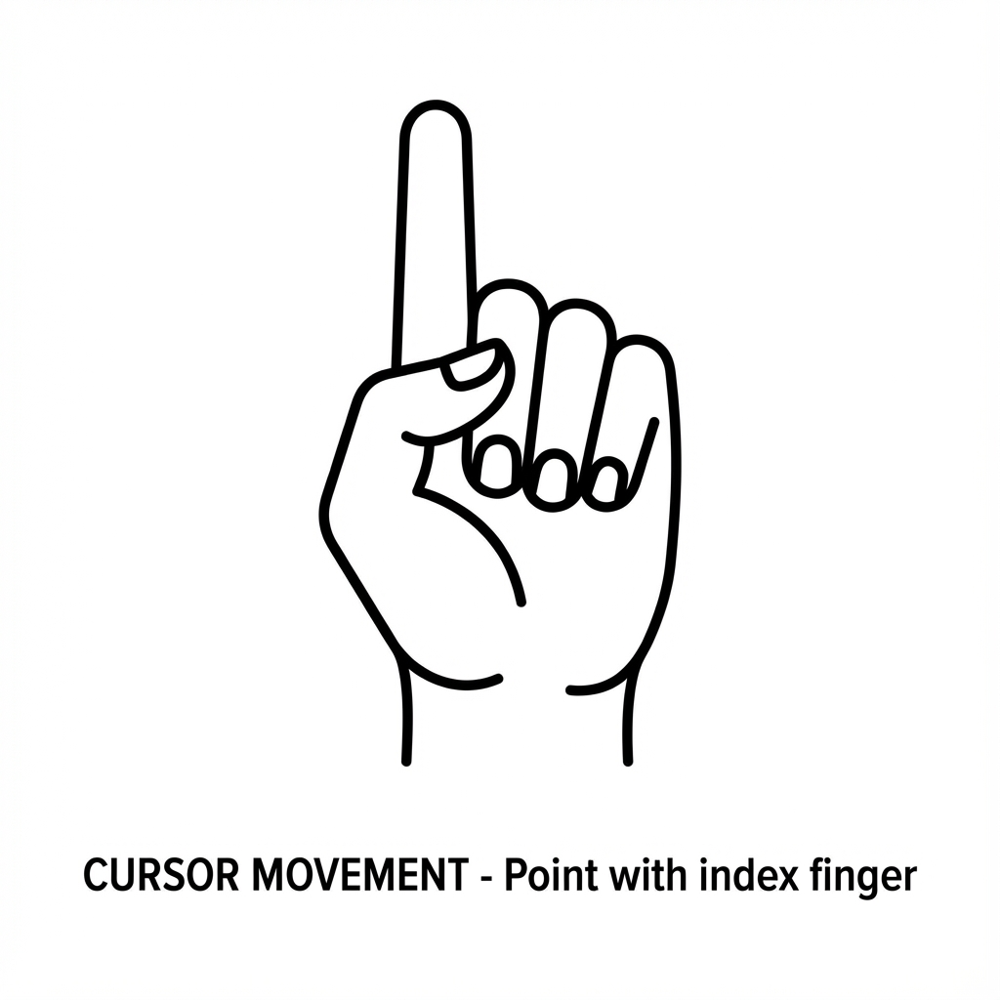
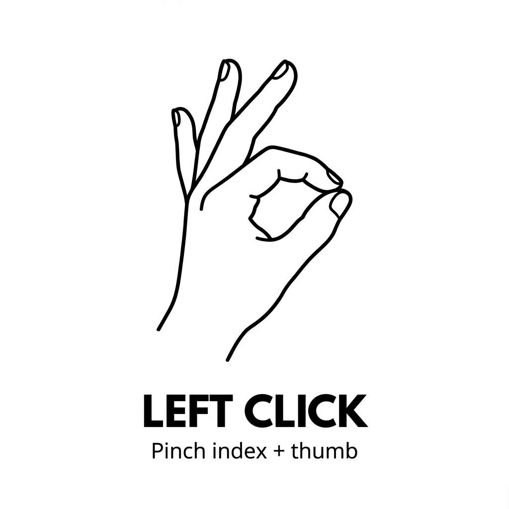
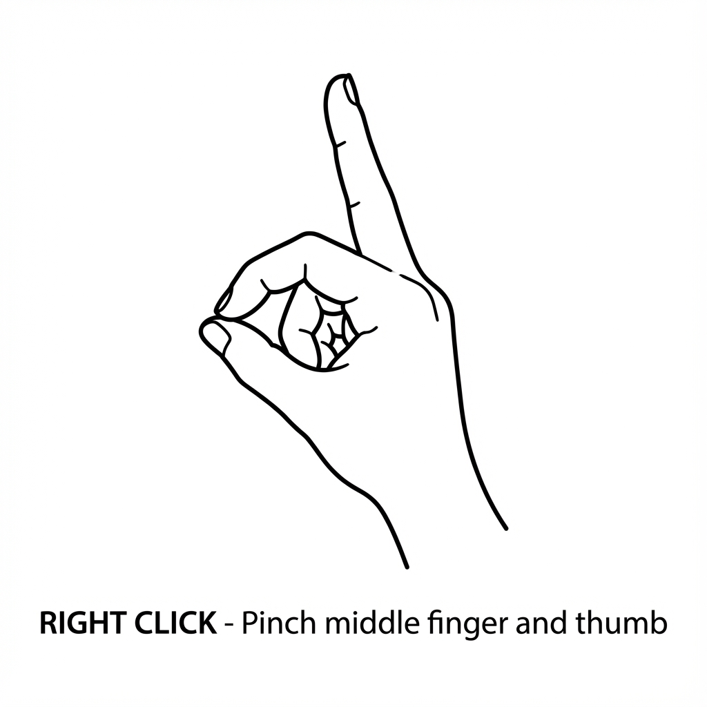
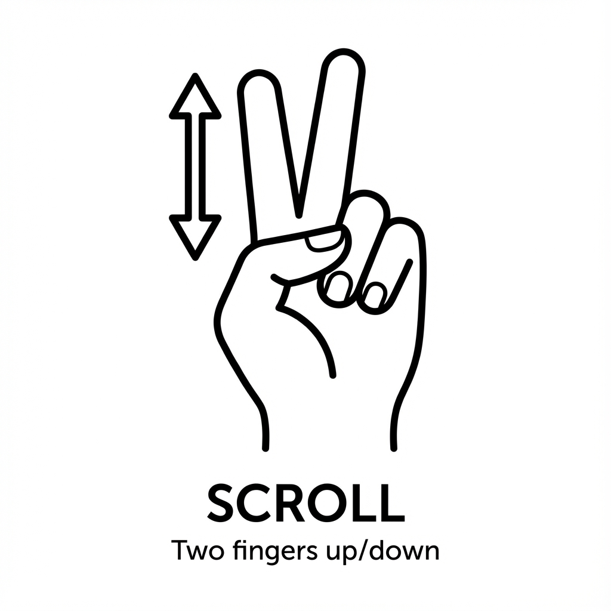

<div align="center">

# 🎮 Gesture Control

**Control your Windows PC with hand gestures using your webcam**

[](https://www.python.org/downloads/)
[](LICENSE)
[](https://mediapipe.dev/)

[Features](#-features) • [Installation](#-installation) • [Usage](#-usage) • [Gestures](#-gestures) • [Configuration](#%EF%B8%8F-configuration)

</div>

---

## 🌟 Features

- **👆 Cursor Control** - Move your cursor with your index finger
- **👌 Left Click** - Pinch index finger and thumb together
- **🤏 Right Click** - Pinch middle finger and thumb together
- **✌️ Scroll** - Move two fingers vertically to scroll
- **📊 Real-time Feedback** - See hand landmarks and FPS in real-time
- **🎯 Smooth Movement** - Advanced smoothing for stable cursor control
- **⚡ High Performance** - Optimized for 25+ FPS on modern laptops
- **🔒 Safety Features** - Failsafe, boundary checking, and emergency stop

---

## 📋 System Requirements

- **OS**: Windows 10 or later
- **Python**: 3.8, 3.9, 3.10, 3.11, or 3.12 (⚠️ **NOT 3.13**)
- **Webcam**: Built-in or external camera
- **RAM**: 4GB minimum, 8GB recommended
- **Processor**: Dual-core 2.0GHz or better

---

## 🚀 Installation

### Quick Start

1. **Download Python 3.12** (if needed)
   ```bash
   # Download from: https://www.python.org/downloads/
   # ✅ Check "Add Python to PATH" during installation
   ```

2. **Clone the repository**
   ```bash
   git clone https://github.com/inanxr/GestureControl.git
   cd GestureControl
   ```

3. **Create virtual environment**
   ```bash
   python -m venv venv
   venv\Scripts\activate
   ```

4. **Install dependencies**
   ```bash
   pip install -r requirements.txt
   ```

5. **Run setup verification**
   ```bash
   python setup.py
   ```

6. **Start the application**
   ```bash
   python main.py
   ```

### Alternative: Direct Run (No Activation)

```bash
cd GestureControl
.\venv\Scripts\python.exe main.py
```

---

## 🎯 Gestures

### 1. Cursor Movement


**How to perform:**
- Point with your **index finger**
- Keep other fingers folded down
- Move your hand to control the cursor

**Tips:** Keep hand 1-3 feet from camera for best tracking

---

### 2. Left Click


**How to perform:**
- Bring **index finger** and **thumb** tips together
- Forms an "OK" sign or pinch gesture
- Release to reset

**Tips:** Make a clear, tight pinch motion and hold briefly

---

### 3. Right Click


**How to perform:**
- Bring **middle finger** and **thumb** tips together
- Keep index finger extended
- Release to reset

**Tips:** Similar to left click, but use middle finger instead

---

### 4. Scroll


**How to perform:**
- Extend both **index** and **middle** fingers (peace sign ✌️)
- Move hand **vertically** up or down
- Up = scroll up, down = scroll down

**Tips:** Make clear vertical movements for best results

---

## 🎮 Usage

### Starting the Application

```bash
# Method 1: With virtual environment activated
venv\Scripts\activate
python main.py

# Method 2: Direct execution
.\venv\Scripts\python.exe main.py
```

### Exiting the Application

- **ESC key** - Clean exit
- **Ctrl+C** - Keyboard interrupt
- **Move cursor to corner** - PyAutoGUI failsafe

### During Use

- Position your hand **1-3 feet** from the camera
- Ensure **good lighting** (natural or desk lamp)
- Make **clear, deliberate gestures**
- Watch the **visual feedback window** to see hand tracking

---

## ⚙️ Configuration

All settings can be customized in `config.py`:

### Detection Thresholds

```python
PINCH_THRESHOLD = 0.03          # Lower = easier to trigger click
SCROLL_THRESHOLD = 0.02         # Lower = more sensitive scrolling
GESTURE_COOLDOWN = 0.5          # Seconds between gesture triggers
```

### Smoothing & Performance

```python
SMOOTHING_FRAMES = 7            # Higher = smoother but slower cursor
CURSOR_SPEED_MULTIPLIER = 1.0   # Increase for faster cursor
SCROLL_MULTIPLIER = 10          # Increase for faster scrolling
```

### Camera Settings

```python
CAMERA_WIDTH = 640              # Reduce for better performance
CAMERA_HEIGHT = 480
CAMERA_INDEX = 0                # Change if using external camera
```

### MediaPipe Confidence

```python
MIN_DETECTION_CONFIDENCE = 0.7  # Hand detection confidence
MIN_TRACKING_CONFIDENCE = 0.5   # Hand tracking confidence
```

---

## 🛠️ Troubleshooting

### Camera Not Working
- ✅ Close other apps using the camera
- ✅ Check Windows camera permissions
- ✅ Try different `CAMERA_INDEX` in config.py
- ✅ Update camera drivers

### Hand Not Detected
- ✅ Improve lighting conditions
- ✅ Move closer to camera (1-3 feet optimal)
- ✅ Ensure hand is fully visible
- ✅ Clean camera lens
- ✅ Lower `MIN_DETECTION_CONFIDENCE` in config.py

### Gestures Not Triggering
- ✅ Make gestures more pronounced
- ✅ Adjust thresholds in config.py
- ✅ Check visual feedback window shows landmarks
- ✅ Increase lighting

### PyAutoGUI Errors
- ✅ Run PowerShell as Administrator
- ✅ Check antivirus settings
- ✅ Verify PyAutoGUI installed: `pip show pyautogui`

### Low FPS / Laggy
- ✅ Reduce camera resolution in config.py
- ✅ Lower `SMOOTHING_FRAMES` (5-7 recommended)
- ✅ Close other applications
- ✅ Check CPU usage

### Cursor Too Jittery
- ✅ Increase `SMOOTHING_FRAMES` (7-15)
- ✅ Ensure stable hand position
- ✅ Improve lighting for better tracking

---

## 📁 Project Structure

```
GestureControl/
├── assets/                 # Gesture images
├── main.py                # Application entry point
├── camera_handler.py      # Camera capture and preprocessing
├── hand_tracker.py        # MediaPipe hand detection wrapper
├── gesture_recognizer.py  # Gesture detection logic
├── system_controller.py   # PyAutoGUI system control
├── config.py             # Configuration parameters
├── utils.py              # Helper functions
├── setup.py              # Setup verification script
├── requirements.txt      # Python dependencies
└── README.md            # This file
```

---

## 🔧 Technical Details

### Architecture

```
Camera → Hand Tracking → Gesture Recognition → System Control
   ↓           ↓                ↓                    ↓
OpenCV   MediaPipe      Distance Calc         PyAutoGUI
         21 landmarks   State Machine         Mouse/Keyboard
```

### Key Technologies

- **[OpenCV](https://opencv.org/)** - Camera capture and image processing
- **[MediaPipe](https://mediapipe.dev/)** - Hand tracking and landmark detection (21 points)
- **[PyAutoGUI](https://pyautogui.readthedocs.io/)** - System control (mouse/keyboard)
- **[NumPy](https://numpy.org/)** - Numerical operations

### Performance Optimizations

- Video mode (not static image) for faster tracking
- 7-frame moving average smoothing buffer
- Single hand tracking for efficiency
- Boundary checking prevents excess movement
- Cooldown timers prevent gesture spam

---

## 🎓 Tips for Best Experience

### Camera Position
- Position camera at **eye level** or slightly above
- Ensure **good lighting** (avoid backlighting)
- **Natural light** or desk lamp works best

### Hand Position
- Keep hand **1-3 feet** from camera
- **Face palm** toward camera
- Make gestures **clear and deliberate**
- Avoid **rapid, jerky** movements

### Practice Exercises

1. **Cursor Control** - Draw circles in the air, move to screen corners
2. **Click Practice** - Click desktop icons, try both left and right click
3. **Scroll Practice** - Scroll through a long document smoothly
4. **Combined** - Navigate websites, use right-click menus

---

## 🚧 Known Limitations

- Works best with **one hand** (configured for single hand tracking)
- Requires **good lighting** conditions
- May not work well with **very dark or very fair skin tones** (adjust camera exposure)
- **Not recommended** for precision tasks (photo editing, CAD)
- Performance depends on **computer specifications**

---

## 🔮 Future Enhancements

- [ ] Double-click gesture
- [ ] Drag-and-drop functionality
- [ ] Pause/resume gesture (closed fist)
- [ ] GUI for settings adjustment
- [ ] Multi-monitor support
- [ ] Application-specific gesture profiles
- [ ] Voice command integration
- [ ] Executable packaging for easy distribution

---

## 📊 Performance Metrics

- **Target FPS**: 30 FPS
- **Typical FPS**: 25-30 FPS on modern laptops
- **CPU Usage**: <30% on dual-core processors
- **RAM Usage**: ~500MB
- **Latency**: <50ms with smoothing

---

## 🤝 Contributing

Contributions are welcome! Here's how you can help:

1. **Report bugs** - Open an issue describing the problem
2. **Suggest features** - Share your ideas for improvements
3. **Submit PRs** - Fix bugs or add new features
4. **Improve docs** - Help make documentation clearer
5. **Share feedback** - Let us know how it works for you

---

## 📝 License

This project is licensed under the MIT License - see the [LICENSE](LICENSE) file for details.

---

## 🙏 Acknowledgments

- **[Google MediaPipe](https://mediapipe.dev/)** - Powerful hand tracking solution
- **[OpenCV](https://opencv.org/)** - Computer vision library
- **[PyAutoGUI](https://pyautogui.readthedocs.io/)** - System automation

---

## 📧 Contact

**GitHub**: [@inanxr](https://github.com/inanxr)  
**Repository**: [GestureControl](https://github.com/inanxr/GestureControl)

---

<div align="center">

**⭐ Star this repo if you find it helpful!**

Made with ❤️ using Python, MediaPipe, and OpenCV

[⬆ Back to Top](#-gesture-control)

</div>
